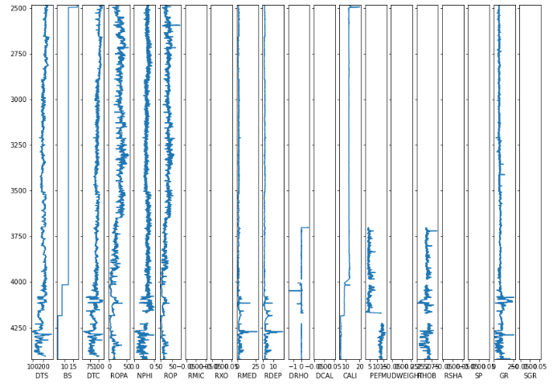
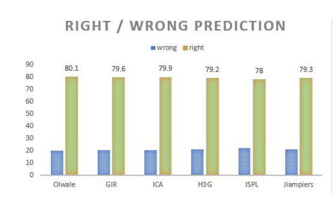

# 岩性预测技术回顾

预训练的模型，隐藏数据集`hidden dataset`上进行评分。
**这不是你每天都能遇到的机器学习比赛**

任务更贴近实际，实现从竞赛到实际解释的转变更为可行，竞赛中引入了几个复杂因素。

首先，与其使用准确率或F1分数`accuracy of F1-score`等指标对分类进行评分，`errors were not punished equally`错误的惩罚并不相同（errors 误差的计算方法不同）。例如，将页岩误认为泥灰岩被认为比将页岩误认为无水石膏要好得多。这种地质学动机`motivated`的分类指标`classification metrics`被编码`encoded`在下面显示的惩罚矩阵`penalty matrix`中。

| Shale for Marl | Shale for Anhydrite |
|----------------|---------------------|
| 页岩用于泥灰岩 | 页岩用于无水石膏  |
| 1              | 2                   |

在机器学习竞赛中引入自定义和更复杂的`evaluation metrics`评估指标总是存在风险。随着复杂度的增加，滥用和意外优化的可能性也增加。
然而，通过引入这样的指标，您可以希望减少优化问题解决方案与领域专家认为是良好测井解释的差异。

其次，就像真实的测井曲线一样，曲线的可用性和覆盖范围因井而异。仅保证少量曲线可用于训练和测试数据。
对于最终评分中使用的`blind test data`盲测数据，团队不知道超出保证范围`beyond what was guaranteed`的曲线的可用性。这立即使机器学习在解决问题上的应用变得复杂。
在解释任务中利用不同的`feature availability`特征可用性是人类通常比计算机做得更好、更自然的事情之一。此外，真实的测井曲线在某些部分或整个井中都缺少曲线。
为本次竞赛精心策划一个人为清洁的数据集，即使不是不可能，也会使实际应用的飞跃变得困难。

## 顶尖团队是如何解决的？

排名前三的队伍分别是 Olawale、GIR 和 Lab.ICA。
前六名队伍的盲测数据准确率。

最终测试数据中的盲井数非常少（10口），很可能还有其他表现优异且有趣的解决方案。

### OLAWALE

Olawale 使用 Kaggle 最喜欢的 [XGBoost](https://xgboost.readthedocs.io/en/latest/) 算法 10-fold 分层`cross validation`交叉验证技术来预测岩性。 GIR 团队也使用了 XGBoost 方法，但 Olawale 采用了更多的定制`customization`。 XGBoost 是一种梯度增强算法，即它训练弱分类器`weak classifiers`的集合`ensemble`并将其转变为分类器。
交叉验证方案可能帮助 Olawale 避免过度拟合`overfitting`排行榜开放测试数据集。
他为防止过度拟合而付出的努力过度拟合似乎已经得到了回报，因为与公开排行榜分数相比，他是少数几个在盲测数据上看到得分显着提高的人之一。

Olawale在进行一系列特征工程`feature engineering`步骤之前，放弃了一些罕见的曲线，如'SGR'、'DTS'、'RXO'、'ROPA'。有趣的是，比赛的获胜者没有努力填补或估计缺失`impute or estimate`的曲线数值`missing curve values`。

Olawale 在训练模型时没有明确使用自定义评分矩阵`custom scoring matrix`，而是依赖于优化器的标准多类对数损失`standard multiclass log-loss for the optimizer`。
这种定制评分可能只用于模型选择、超参数优化以及选择忽略哪些曲线时`model selection, hyperparameter optimization, and when choosing which curves to ignore`。

### GIR TEAM

GIR团队使用与Olawale使用的方法相同。GIR团队的(magic 解决方案)魔法不在于选择分类器，而在于缺失曲线的填充和特征增强`imputation of missing curves and feature augmentation`。
GIR团队利用曲线的物理理解`physical understanding`来具体选择哪些其他曲线可能指示缺失值`indicate missing values`。例如，他们用非局部信息增强每条曲线，在这种情况下是梯度。
Notes:可以再对照原文进行内容理解。
此外，他们对原始特征进行多项式特征工程`polynomial features of the original features`。

GIR团队在模型的优化或训练中没有包括自定义评分矩阵`not include the custom scoring matrix in the optimization or training`，很可能只是用于模型选择`model selection`。

### ICA TEAM

ICA团队使用了RandomForest算法，这是另一种常见的提升树方法，概念上与前两支队伍使用的XGBoost并没有太大不同。ICA团队采用了5-fold 分层交叉验证技术，类似于Olawale使用的方法。

在特征工程步骤中，ICA团队添加了`normalized`归一化的GR和RHOB，以及一些曲线的梯度`gradient of a number of curves`。他们将地层包括在特征中`formation as a feature`。没有尝试填补缺失的曲线，而是用中位数值填充`simply filled with median values`。

ICA团队在训练模型时也没有包括自定义评分矩阵，可能只是用于模型选择。

## （最终的）想法

`Combining boosted trees with common sense feature augmentation and preprocessing`将增强树与常识特征增强和预处理相结合似乎取得了成功。有趣的是，顶尖团队中没有一个明确地在优化模型参数`optimization of their model parameters`时使用自定义评分指标。似乎使用经过时间验证的标准方法的标准实现，结合强大的防止过拟合的措施，可能比引入符合地质动力学惩罚矩阵的自定义损失函数更有效。

官方[[GitHub](https://github.com/bolgebrygg/Force-2020-Machine-Learning-competition)]
