# 机器预测岩相竞赛结果

10口盲井的数据集评分

1) 奥拉莱·易卜拉欣
2) [GIR团队](https://giruenf.org/)
3) Smith W. A. Canchumuni[ICA团队Lab](https://ica.ele.puc-rio.br/)。

盲数据集上的最终分数与测试数据相比有显着差异。模型与数据过度拟合`overfitted`以及盲数据`blind data`与`combined train and test data`组合训练和测试数据不具有相同岩性分布的`combined effect`综合效应。最终分数非常接近，当查看测井曲线的预测时，前 5-7 个模型之间的差异有小。因此前 7 名胜利者。

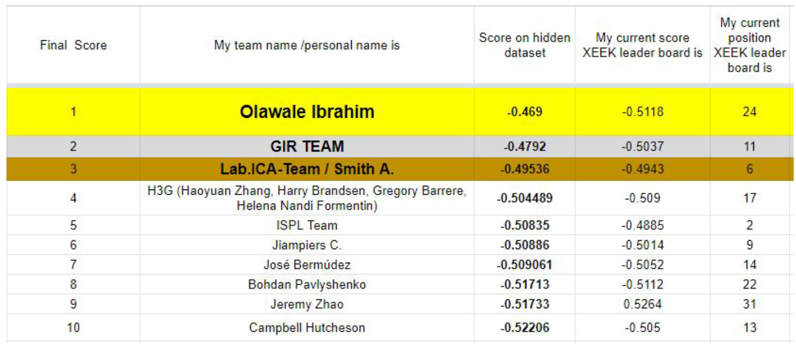

数据、代码和最终得分：[[code](https://github.com/bolgebrygg/Force-2020-Machine-Learning-competition)]

**在`blind /train / test dataset`盲目/训练/测试数据集中，获胜模型的`Confusion matrix`混淆矩阵 。**

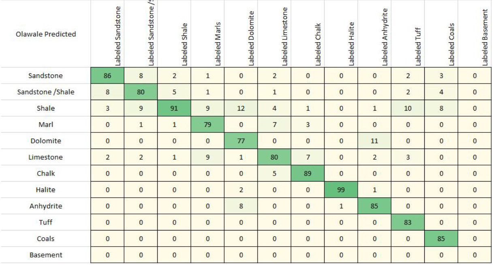

## The Dataset

`consistent dataset`一致数据集。法律问题，清理测井曲线，对`lithology`岩性做出`consistent interpretation`一致的解释。FORCE 与 [ [EXPLOCROWD](https://www.explocrowd.com/) ] ，使用内部数据、`completion logs`完井测井、`mud logs`泥浆测井，当然还有`wireline curves`电缆曲线进行手工岩性解释。 [ ​[I2G.cloud](https://www.i2g.cloud/) ] 提供 14 口井的岩性

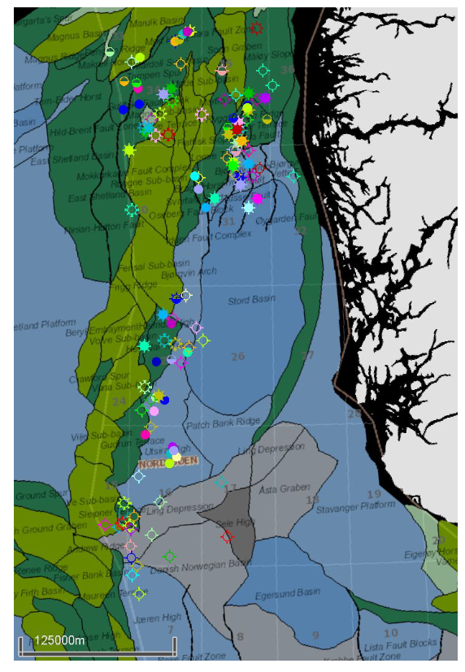

118 口井数据集横跨南维京地堑和北维京地堑，并渗透了从南部二叠纪蒸发岩到北部深埋布伦特三角洲相的高度变化的地质。仅提供 10 个日志（测试数据集）的井和 10 个根本不向参赛者提供的井(盲井)。盲数据集用于评估所提供模型的最终分数。事后看来，应该选择更大的盲数据集，因为盲数据集没有完全代表`train`训练数据集的岩性分布。这最终带来了运气成分。因此，未来看这些数据如何被争议、剖析和分析将会很有趣。希望通过增加更多数据来扩充数据集。

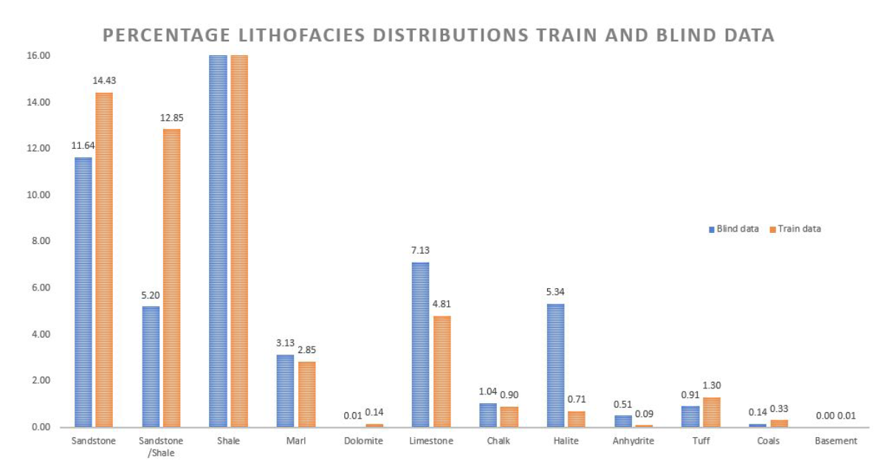

数据集总体质量很高，但也并非没有缺陷。仍然基于对各种数据类型的半主观“解释”。它也是基于人的，容易出错。在分析部分，将强调其中的一些缺点并概述这些缺点的潜在解决方案。

训练数据以及盲数据的调查显示，挪威近海的岩性记录主要由页岩和页岩沉积物主导。其次是砂岩、石灰岩、泥灰岩和凝灰岩。在训练数据和盲数据之间存在不平衡，盲数据中含有更多的盐和硬石膏，而平均含有更少的沙和更少的砂岩/页岩。

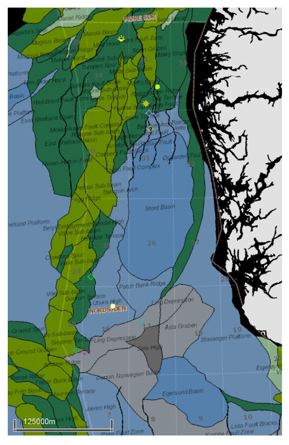

这10口盲井区域在感兴趣的区域内分布相对均匀。

**机器岩性预测深度分析 人类与机器(使用计算机的人类)！**

机器在预测岩性方面有多好？我们可以从中学到什么？即使是最好的模型也只能在盲数据上实现 80% 的正确预测。亚军型号的得分均在 78% 至 79% 之间。排名第三的模型甚至比第二名的模型实现了更高的正确预测百分比，但由于使用了基于岩石物理的评分矩阵，因此在一些明显的岩性错误上受到了更严厉的惩罚。顶级模型在解决方案方面非常接近，只有很小的细节决定了最终谁将成为获胜者。

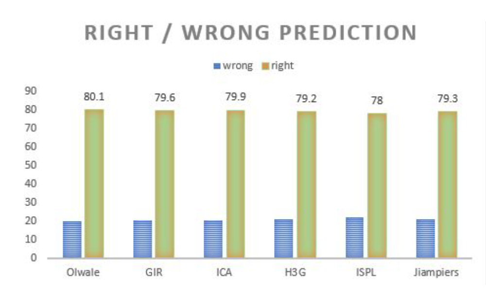

**`petrophysical interpretation`岩性解释评分矩阵`scoring matrix`**

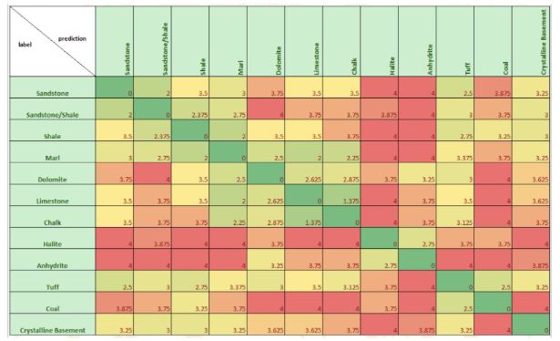

详细讨论三口井（16/7-6，31/2-10，16/2-7）。所显示的预测从左到右依次为（Force解释，Olawale，GIR，ICA，H3G）。

16/7-6 井中正确/错误列中的红色数量，开始可能会认为井数据上的机器学习对于无聊的数据科学家来说是一种无用的娱乐。这口井中超过 60% 的预测都是错误的。

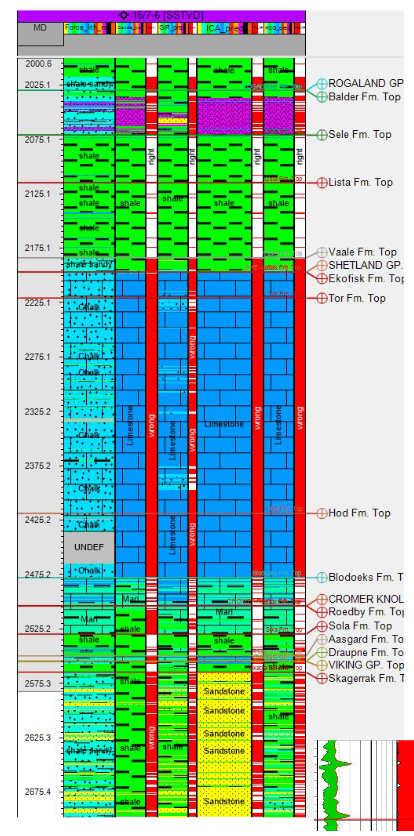

第二次看时会发现，这些预测也许并不那么糟糕。把石灰岩`limestone`误认为白垩`chalk`是完全可以理解的。

模型真正遇到困难的地方在于区分`silty shale`粉质页岩和页岩质粉砂或页岩砂岩`shaly silt or a shaly sandstone`等细节。这些模型表明，这可以被解释为两种方式，显然，即使是专家在像`Skagerrak`斯卡格拉克这样的混合地层`mixed formations`中也很难定义确切的岩性`exact lithology`。GIR团队和H3G团队提出了良好的预测。

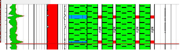

有趣的是，没有团队建立了一个适当的算法来映射如下所示的字符串。

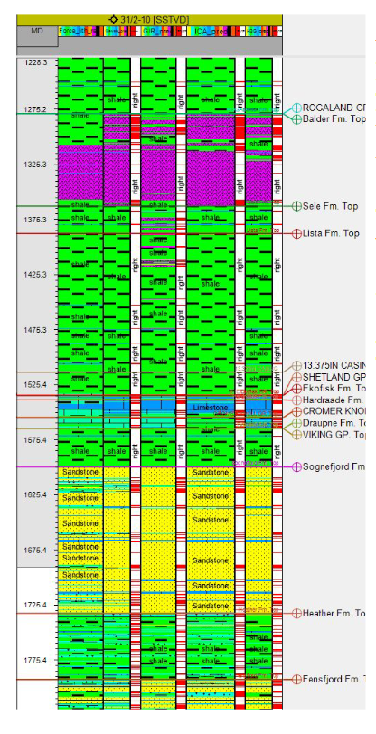

31/2-10井在盲数据集中显示出略高于平均水平的预测准确性。

人们甚至可以说机器的解释率达到 95%，并且需要检查标签数据的细微不一致。标签数据完全有可能是错误的。

仅凭测井数据很难准确界定石灰岩和泥灰岩之间的界限`boundary`。

同样，定义`dirty sandstone`脏砂岩和`clean sandstone`干净砂岩之间的界限并不容易，并且常常受到很大程度的`individual judgement`个人判断的影响。

这里提交的机器学习模型通常比人类解释者更具有极端性。

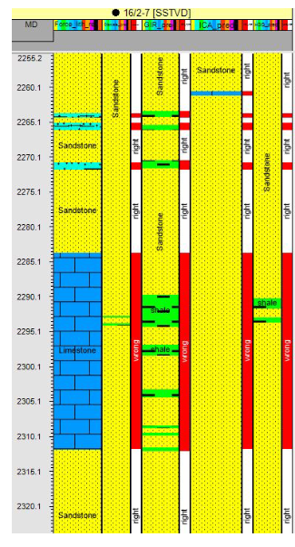

在16/2-7井（约翰·斯维德鲁普油田）的Rotliegendes层段展示了机器学习的实用性。有趣的是，所有模型都没有识别出`center of a sandstone sequence`砂岩层中心的明显石灰岩`limestone`。回顾`mud logs`泥浆记录，发现FORCE提供的石灰岩标签完全错误。FORCE的解释员被泥浆记录上`wrong lithology symbol`错误的岩性符号所误导。

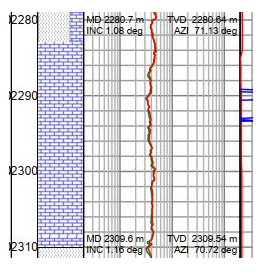

原来这个`interval is cored`间隔是有核的，整个核心由一种`lovely conglomerate and breccia`可爱的砾岩和角砾岩组成，如下图所示。

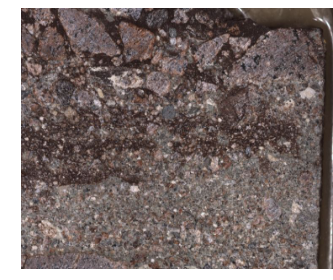

这只是一个例子，所有的机器学习模型都不同意FORCE给出的标签。在几种完全不同意的情况中，发现标签是可以被质疑的，最近获取的NOROG岩芯图像有助于解决明显的解释冲突。

### 从区域地质学家的角度`regional geologists point of view`得出的结论。我们应该使用这些机器生成的数据吗？（彼得·博曼的个人观点）

在分析第一批结果时，我对机器表现如此糟糕感到震惊，直到意识到我把图例搞错了.....(-: 修正图例后，我对结果感到好奇，但并不完全信服。然后我开始用岩芯图像和更详细的泥浆记录描述来交叉验证一些标签。

在大多数情况下，这台机器似乎提供了类似80-95%的解决方案。可以质疑是否可以实现100%的解决方案，因为一开始在分配岩性标签时存在系统性的不确定性。

`Real ground truth data`真实的地面真实数据很难获得，`core data`核心数据过于偏向沙子`biased towards sands`，而`cuttings data`岩屑数据受到`vertical resolution loss`垂直分辨率损失的影响。

从这个角度来看，没有团队能够在盲数据集上获得远高于 80% 的分数也就不足为奇了。 80% 可能代表输入标签、`log curves`测井曲线和逃脱绝对定义的岩石类型的`combined uncertainty`综合不确定性。然而，我希望这一假设将来会受到挑战。

将机器预测与内部数据和供应商购买的数据进行比较，我得出结论，机器预测提供了一个`extremely valid second opinion`非常有效的第二意见，并经常突出了这些大型数据库中的明显缺陷`highlight the very clear shortcoming in these large databases`，这些数据库在过去50年中被不太一致` inconsistently`地策划。

我认为这场比赛是机器学习如何有效和丰富我们的地球科学工作流程的典范。在数据集上运行所有模型，然后分析与原始标签或解释者意见的一致和分歧，提供了一种有效的方法来研究大型数据集，同时帮助构思。

可以分析一下，例如，如果机器预测错过的沙子`predicted missed sand`是真实的，而且结果证明是真实的，那就开始梦想新的探索机会。

是的，我们必须（也希望）使用这些机器生成的数据，但必须与富有质疑精神和专业知识的地球科学家一起使用！

## 获奖团队提交作品的更多分析

`well logs in the North Sea`北海井下测井通用岩性预测的最佳模型。

查看下面盲数据的`confusion matrix (percentage)`混淆矩阵（百分比）可以看出模型在正确预测岩相类型方面存在困难。所有模型都难以正确识别`Dolomites`白云岩（train.csv中有1700个样本），以及`Tuffs and the Coals`凝灰岩和煤。正如之前讨论的那样，很明显模型很难将砂岩/页岩（含有杂质的砂岩和砂质页岩）`Sandstone /Shale (dirty sands and sandy shales)`进行分类。部分原因是标签本身以及算法的不确定性。

仅从混淆矩阵来看，排名第四的H3G模型似乎产生了最平衡的结果，但Olwale在这个盲数据集上表现更好，因为引入了评分矩阵的差异惩罚。

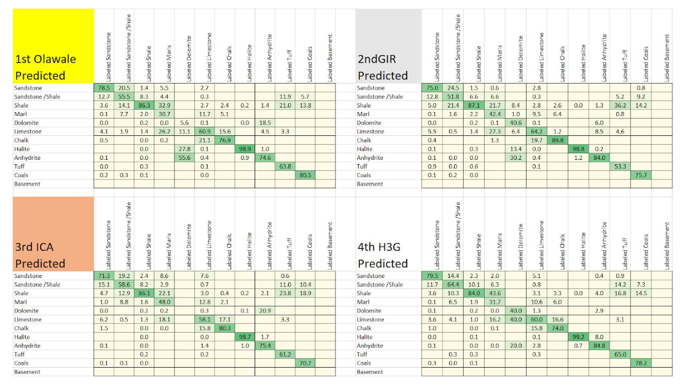

通过查看Olawale和H3G之间每个类别的绝对分数（样本数量*评分矩阵中的惩罚）可以发现，尽管H3G看起来平衡，但他们在正确识别石灰岩和泥灰岩方面确实遇到了困难（红色数字），而在更好地识别砂岩/页岩类别方面，他们胜过了Olawale（绿色数字）。H3G将大量页岩样本错误地归类为砂岩类别。

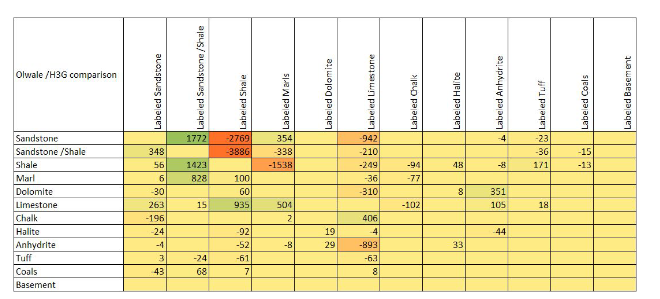

与ICA团队相比，Olawale在较少见的岩性上表现更好，但相比之下在准确划分砂岩/页岩类别方面ICA团队则遇到困难。

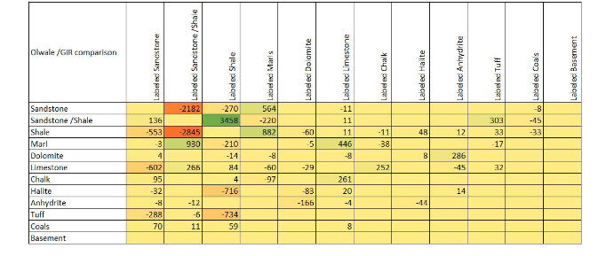

看起来每个模型在某些类别上都有自己的优势，下一个合理的步骤是将它们结合起来，形成一个预测能力强的集成模型。

分析 Olawle 模型在训练、测试和盲数据集中所有井上运行的混淆矩阵，可以很好地表明模型的整体性能以及在地球科学生产环境中从此类模型可以实现的可能“正确性”。

对算法的额外调整，例如对`attention to thin beds`薄层的关注、对`less common lithologies`不常见岩性和`geographical clustering`地理聚类的更好预测，可能会将结果推至 85-90% 的分数范围，这将与正常人类表现相当或更好。

请您在博客文章末尾查看标签与预测结果的比较，自行决定您是否喜欢机器的解释。

### Olawale模型中所有井的最终混淆矩阵

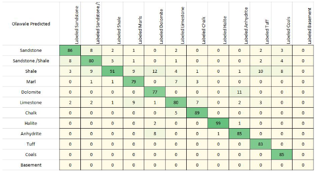

## 一些团队的笔记

**我们要求前十名团队写一段简短的自我介绍和模型介绍。**

### Olawale Ibrahim

毕业项目，研究深度学习在油藏表征和更好的地层评价中的应用。采用了10-fold xgboost分层交叉验证技术作为最终模型。进行大量的`local validations`本地验证，以避免过度拟合开放测试LB。从训练数据集中选取了10口随机井用于准备验证集。每个训练集都准备了两个验证集。

### GIR team

研究小组。通过`geological, geophysical, and reservoir engineering data`解决与地质、地球物理和油藏工程数据`integrated analysis`综合分析相关的问题来改进油藏表征和管理`improve reservoir characterization and management`。

主要关注点是构建一个强大而高效的`classifier`分类器，以处理训练数据集。XGBoost适合这样的任务，涉及到`preprocessing, data imputation, and feature augmentation`预处理、数据插补和特征增强的标准步骤。努力集中在`training, cross-validation, and testing strategies`训练、交叉验证和测试策略上，以`fine-tune the classifier`微调分类器。采用岩石物理学的视角，专门`specialize preprocessing`定制预处理，`feature selection`执行特征选择和工程，利用`wavelet transform`小波变换来帮助区分特定的岩性。

### ICA team  

机械工程硕士和电气工程博士学位。机电一体化工程师，应用计算智能实验室（ICA）担任研究员。`purpose of filling the missing values`为了填补缺失值，简单的方法根据变量类型（连续或离散）使用中位数或众数来完成数值。在训练模型时，仅使用数据超过50%的变量。此外，`introduce temporal information was created new features based on the differential value with respect to depth`为了引入时间信息，基于深度的差分值创建了新特征。训练过程包括使用`ensemble network`集成网络，通过scikit-learn库实现。在输出网络中，我们`median filter`应用中值滤波器，使用由`kernel size`核大小给定的`local window-size`局部窗口大小来替换`isolate prediction values`孤立的预测值。

### H3G Team (Equinor)

Equinor的H3G团队（​Harry Brandsen，​Haoyuan Zhang，​Helena Nandi Formentin，​Gregory Barrere）。

Harry拥有地质学学位，但他的职业生涯大部分时间作为一名岩石物理学家，并且一直对编码和数字化充满浓厚兴趣。
Haoyuan是一位数据科学家，拥有贝叶斯统计学和推断的博士学位，之前参与过并且目前还在参与其他机器学习项目。
Helena是一位软件开发者，拥有统计学和石油工程的博士学位，确保没有一个数据点被忽视。
Gregory是一位地球/数据科学家，拥有石油地球科学的硕士学位，位于地球科学和数据分析/机器学习之间的桥梁。

结合并发挥专业领域专家技能以及纯粹的数据科学/机器学习知识的最佳效果。
广泛的背景极大地促进了以高效方式执行这些循环的工作。

### ISPL team  

图像和声音处理实验室（ISPL）的研究人员和博士生。研究重点是`advanced multimedia signal`先进的多媒体信号处理和`geophysical data processing solutions`地球物理数据处理解决方案。
基于`boosted trees`提升树；根据当前测试井中存在的特征训练不同的模型。最终模型是通过在验证中最佳模型之间进行`soft voting`软投票获得的。

### Maykol Jiampiers Campos Trinidad

机电工程师。双学位MBA学生。

解决方案，`handling null values`处理空值时，我用每个数值特征的中位数填充，对于`categorical variables`分类变量则用`most frequent value`最频繁的值（众数）进行独热编码`one-hot encoding.`。
创建了一些`new features`新特征，比如介孔度（PHIA）、总有机碳（TOC）等；并只选择了最重要的属性`took just the most important attributes`。
为了训练，我选择了`default model Random Forest`默认模型随机森林，使用了5折分层交叉验证，并进行了一种`ensemble for inference`推理集成，选择了具有`best mean probability`最佳平均概率的类别。在后处理中，编写了一个函数，以避免在20个测量窗口中出现`isolated labels`孤立标签。

### José David Bermúdez Castro  

博士，电气工程硕士，ICA担任研究员。深度学习、模式识别、计算机视觉和遥感技术 `Deep Learning, Pattern Recognition, Computer Vision, and Remote Sensing`。
首先`filling the missing values`填补最相关特征的缺失值，然后训练一组随机森林分类器`random forest classifiers`委员会。
一些特征通过中位数统计填充，其他特征通过复制最后一个有效值进行填充，自上而下或反之（边缘填充），`by the depth and well`首先按深度和井进行`sorting`排序。最后，其他特征通过回归模型进行估计。

### Jeremy Zhao  

工艺工程师，岩性学知之甚少，所幸在涉及该领域专业知识时，我能找到可询问的人。
需要迅速理解，以便构建一个足够好的模型来预测岩性。
学习如何在对数尺度上查看数据分布、使用标签编码器对地层进行分类、知道如何在同事的帮助下处理异常值以及填补缺失值（尽管将空值或空白留作零比填补更好）确实有助于理解机器学习的响应方式。
最终代码中没有展示的一点是特征工程和特征重要性运行，以查看哪些变量可能有助于我的模型，这就是为什么我最终包括了`rate of penetration`（ROP），因为在我看来ROP足够高，足以影响结果。

### Campbell Hutchinson

描述：上市科技公司的首席客户官。不同的选择（如PyTorch、Fastai、RapidsAI、LightGBM、CatBoost、XGBoost、SkLearn等）使用一个相当传统的机器学习堆栈。
最终，XGBoost与超参数优化的组合似乎是一种有效的方法，因为XGBoost具有GPU功能，并且基于树的方法在数据集上似乎很有效，这使得快速实验成为可能。
观看关于岩石岩性的在线视频，试图了解哪些复合特征可能对模型有用。

值得进一步探讨如何处理类似比赛中的数据集，看起来数据量很大（超过100万行），但实际上并不像看起来那么多（约100口井），因为这些井具有很多内在相似性，需要利用`well labels`井标签来组织验证方法。
挑战，因为使用大量折叠进行模型超参数的k-fold验证成本很高，但使用其他验证方法则可能使超参数过度拟合所选验证集，或者如果使用少量折叠进行k-fold验证，则训练数据可能不代表最终问题，因为折叠训练数据比最终训练集要小得多（例如对于3-fold：约66口井折叠训练，约100口井最终训练）。

### Bohdan Pavlyshenko​

数据科学家，博士，乌克兰

### 井的例子与预测（左侧为Force标签/奥拉瓦莱的预测右侧）（盲/测试训练井）

参考原文

[官方链接](https://www.sodir.no/en/force/Previous-events/results-of-the-FORCE-2020-lithology-competition/)
