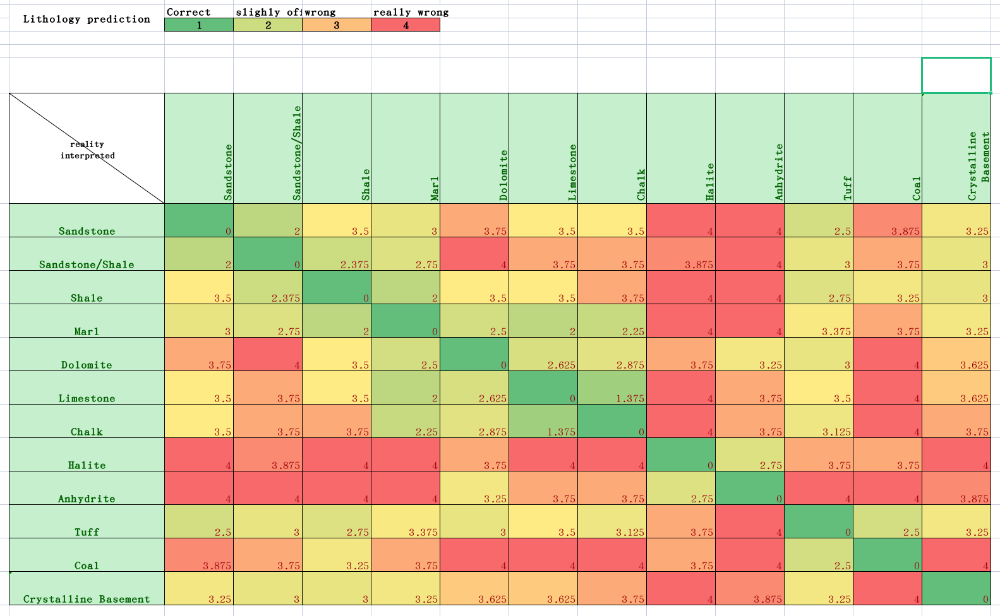

# 岩石评分矩阵 cost function

岩性预测

实际情况 解释结果

正确：1；
略有偏差：2；
错误：3；
严重错误：4；

岩性类别：砂岩、泥岩、页岩、白云石、石灰岩、白垩、岩盐、硬石膏、凝灰岩、煤、结晶基底

为了对测井数据进行机器学习成果评分，我们需要一个评分矩阵，该矩阵对地质上不合理的结果进行更严厉的惩罚，而对地质上可能合理且可能不那么重要的错误则惩罚较轻，在常规机器学习中，所有的错误都被同等评分，这导致了地质上不太可能的解释。

假设有以下测井数据：伽马射线（GR），密度（DENS），中子（NEU），声波时差（SON），电阻率（RES），井径（CALIPER，冲蚀）`CALIPER (WASHOUT)`
